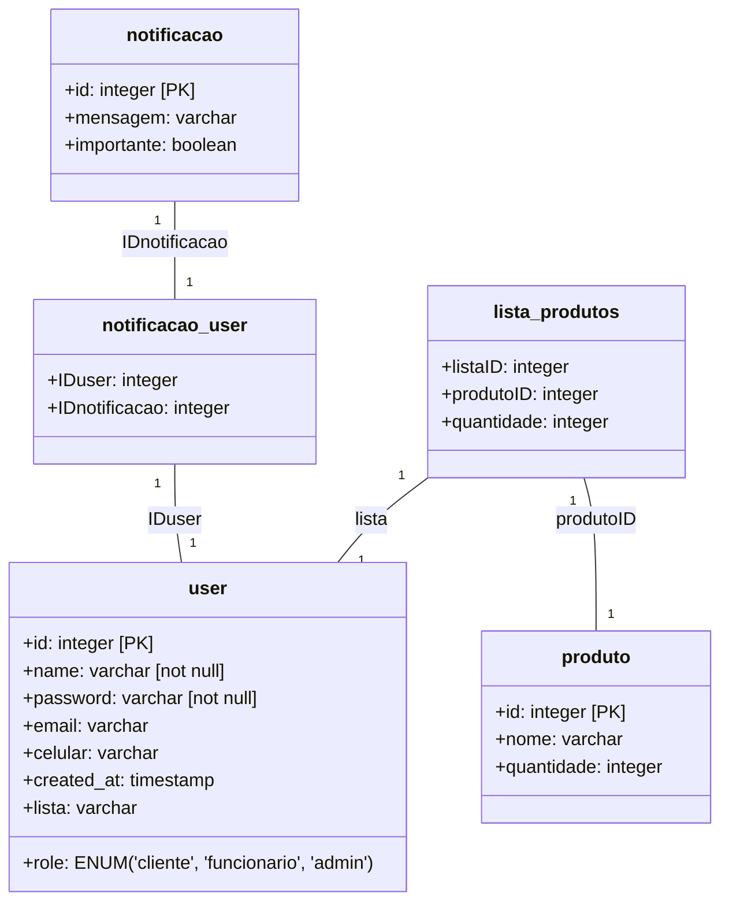

# PROJETOS III <br> ❄ TecFrio

## 📋 Apresentação
O projeto desenvolvido pelo grupo tem como objetivo desenvolver uma solução para as demandas da empresa itabirana TecFrio, visando auxiliar na organização dela, bem como automatizar e facilitar os seus processos cotidianos. 
Para atingir nossa meta, nós desenvolvemos um aplicativo mobile, em Flutter, para controle de inventário, no qual uma funcionário pode realizar o CRUD completo dos recursos disponiveis no estoque da empresa. Além disso, o aplicativo também
permite ao usuário registrar notificações para registrar de tarefas importantes na sua rotina. 

Para conher melhor o projeto, faça dowload do nosso [vídeo](Apresentacao_video.mp4)

## 💾 Banco de dados 
Entenda como foi feita a organização do projeto e como se dá a relação das entidades no banco



Tabela <mark> user </mark> - Armazena informações dos usuários do sistema (clientes, funcionários e administradores)

Tabela <mark> produto </mark> - Cadastro de produtos disponíveis para uso nos serviços

Tabela <mark> lista_produtos </mark> - Tabela de junção que relaciona produtos a serviços com suas quantidades para cada usuário

Tabela <mark> notificacao </mark> - Registra as informações de uma notificação criada por um usuário

Tabela <mark> notificacao_user </mark> - Tabela de junção com o id da notificação criada e seu respectivo dono


## 🛠️ Estrutura
Conheça a estrutura da aplicação

```
📦projetos_3
└─📂 lib
  ├─ 📂 cache  # Armazena variáveis
  ├─ 📂 models # Modelos de dados
  ├─ 📂 screens # Telas do aplicativo
  ├─ 📂 services # Serviços (manipulação, autenticação, etc.)
  ├─ 📂 utils # Rotas do aplicativo
  ├─ 📂 widgets # Interfaces, como a navbar e os itens da notificações
  ├─ 📄 MyApp.dart # Armazena a personalização do app
  ├─ 📄 firebase_options.dart # Configurações automáticas do firebase
  └─ 📄 main.dart  # Ponto de entrada do aplicativo
```

##  🔴 Pré-requisitos 
Itens que você precisa antes de rodar o código:

**Flutter**
<details> <summary><strong> Windows </strong></summary>
  
  Download oficial [aqui](https://flutter.dev/docs/get-started/install)
  
  Extraia para C:\src\flutter
  
  Adicione ao PATH: C:\src\flutter\bin
  
  Instale a extensão Flutter no VS Code
  
  Execute no terminal:
    ```
    flutter doctor
    ```
</details> 
<details> <summary><strong>Linux</strong></summary>
  
  No terminal:
  
  ```
    sudo snap install flutter --classic
    flutter doctor
  ```
</details> 

**Android Studio**
  
  1. Download oficial [aqui](https://flutter.dev/docs/get-started/install)

  2. Instale os SDK Tools durante a instalação

  3. Configure o Emulador Android através do AVD Manager

  4. Aceite as licenças no terminal:
  
    flutter doctor --android-licenses
  
    
 
## 🟡 Preparando o projeto
Como configurar o ambiente

1. Abra o VsCode
2. Pressione Ctrl+Shift+P (Windows/Linux) ou Cmd+Shift+P (macOS)
3. Digite "Flutter: New Project"
4. Selecione "Application" e aguarde criar o aplicativo
5. Apague a pasta lib criada automaticamente
6. Copie a pasta lib do repositório

## 🟢 Inicialização
Como iniciar a aplicação 

No terminal do VsCode, digite:
```
flutter pub get
flutter clean
flutter run
```

Agora, aproveite o nosso projeto!


## 👨‍💻 Desenvolvedores
Membros do grupo responsáveis pela criação do projeto

Diego Penna Andrade Barros #PD274 <br>
Diagrama do banco

Isabela Maria De Sá Teixeira#PD341 <br>
Testes

Joao Vitor Moreira #PD079 <br>
Fluuter

Rafael Pastor #PD009 <br>
Flutter

  


